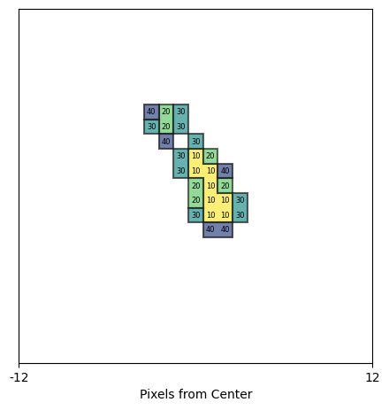
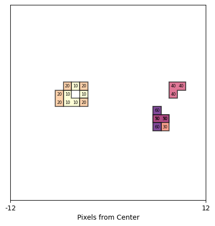

# visualize_pixel_map

A Python package to visualize pixel hit time development from neutron detector data. Integrates seamlessly with [neutron_event_analyzer](https://github.com/TsvikiHirsh/neutron_event_analyzer) for automatic pixel-photon-event association.




## Installation

Install the package via pip:

```bash
pip install git+https://github.com/TsvikiHirsh/visualize_pixel_map
```

For automatic association features, also install neutron_event_analyzer:

```bash
pip install git+https://github.com/TsvikiHirsh/neutron_event_analyzer
```

## Quick Start

```python
import visualize_pixel_map as vpm

# Load data from a neutron data folder
data = vpm.Data("data/neutrons")

# Visualize with filtering
data.plot(
    events=slice(0, 10),      # First 10 events
    toa_range=(0, 0.005),     # 0-5ms
    color_by='tot',           # Color by energy (TOT)
    cmap='plasma'
)
```

## Features

### 🚀 **New in v2.0**

- **Lazy histogram computation**: No pre-computation overhead - histograms created on-demand
- **Filter-then-histogram**: Efficient filtering before histogram creation
- **Pandas query support**: Complex filtering with query strings
- **Verbosity levels**: Control output detail (QUIET/BASIC/ADVANCED)
- **Data inspection**: Properties and methods to explore available data
- **TOA/TOT coloring**: Choose between time-based or energy-based coloring
- **Wildcard support**: Load specific files using glob patterns
- **Multiple CSV concatenation**: Automatically combine multiple AssociatedResults files

### 📂 Data Loading

#### From Folder (Recommended)

```python
# Auto-detects AssociatedResults folder
data = vpm.Data("data/neutrons")

# Loads ALL CSV files from AssociatedResults and concatenates them
# data/neutrons/AssociatedResults/*.csv
```

#### With Wildcards

```python
# Load specific files using wildcards
data = vpm.Data("data/AssociatedResults/data_*.csv")
data = vpm.Data("data/AssociatedResults/data_[0-3].csv")
```

#### From CSV File (Legacy)

```python
# Direct CSV file loading
data = vpm.Data("data.empirphot.csv")
```

### 🔍 Data Inspection

```python
# Get overview of available data
data.info()

# Access properties
print(f"Total photons: {data.photons['count']}")
print(f"Photon ID range: {data.photons['range']}")
print(f"Total events: {data.events['count']}")
print(f"Time range: {data.times['range']}")

# Access raw dataframe
df = data.associated_df
high_energy = df[df['tot'] > 100]
```

### 🎯 Filtering

#### Filter by Photons, Events, or Pixels

All filter parameters accept multiple formats:

```python
# By index range (tuple)
data.plot(photons=(0, 10))      # First 10 photons
data.plot(events=(5, 15))       # Events 5-15

# By slice
data.plot(photons=slice(0, 10)) # First 10 photons
data.plot(events=slice(5, 15))  # Events 5-15

# By specific IDs (list)
data.plot(photons=[0, 5, 10])   # Specific photon IDs
data.plot(events=[1, 2, 3])     # Specific event IDs

# Single ID (int)
data.plot(photons=5)            # Single photon
data.plot(events=2)             # Single event
```

#### Filter by Time of Arrival

```python
# Filter by TOA range (in seconds)
data.plot(toa_range=(0, 0.006))
data.plot(toa_range=(0.002, 0.008))
```

#### Advanced Filtering with Query Strings

```python
# Filter by TOT threshold
data.plot(query="tot > 50")

# Complex boolean logic
data.plot(query="(tot > 30 & tot < 100) | (x > 200)")

# Use association data
data.plot(query="assoc_event_id.notna() & pixel_spatial_diff_px < 5")

# Combine multiple filters
data.plot(
    photons=(0, 20),
    toa_range=(0, 0.005),
    query="tot > 40"
)
```

### 🎨 Visualization Options

#### Color by TOA or TOT

```python
# Color by Time of Arrival (default)
data.plot(color_by='toa', cmap='viridis')

# Color by Time Over Threshold (energy)
data.plot(color_by='tot', cmap='plasma')
```

#### Color by Photon or Event ID

```python
# Color by photon ID (discrete colors)
data.plot(
    photons=(0, 20),
    color_by='photons',
    cmap='tab20',
    show_legend=True
)

# Color by event ID (discrete colors)
data.plot(
    events=(0, 10),
    color_by='events',
    cmap='viridis',
    show_legend=True
)

# Show non-associated pixels as gray (default: filtered out)
data.plot(
    photons=(1, 20),
    color_by='events',
    cmap='viridis',
    show_assoc=False,    # Show non-associated pixels in gray
    show_legend=True     # Legend includes "Not associated"
)
```

#### Zoom and Display Options

```python
data.plot(
    zoom_size=40,           # Square zoom region size
    zoom_region=(100, 150, 100, 150),  # Custom region
    show_labels=True,       # Show timestamp labels
    show_legend=True,       # Show color legend
    show_scale=True,        # Show pixel scale
    despine=False,          # Keep plot spines
    cmap='viridis_r',       # Reversed viridis colormap
    time_bins=80            # Max time in ns
)
```

### 🔊 Verbosity Levels

```python
# QUIET - No output
data = vpm.Data("data/neutrons", verbosity=0)
data.plot(verbosity=0)

# BASIC - Progress bars and minimal info (default)
data = vpm.Data("data/neutrons", verbosity=1)
data.plot(verbosity=1)

# ADVANCED - Detailed filtering information
data = vpm.Data("data/neutrons", verbosity=2)
data.plot(verbosity=2)
```

Example ADVANCED output:
```
  - TOA range filter: 45231 rows remain
Filtered: 45,231 rows (from 98,426, 46.0%)
Creating histograms: 100%|████████| 500/500 [00:01<00:00]
Created 500 histograms covering 45231 pixels
```

### 🔗 Integration with neutron_event_analyzer

```python
# Automatically runs association if AssociatedResults not found
data = vpm.Data(
    "data/neutrons",
    auto_associate=True,           # Default: True
    association_mode='full',       # 'pixel_photon', 'photon_event', or 'full'
    settings="settings.json"       # Optional settings file
)

# Or use settings dictionary
settings = {
    "pixel_photon": {
        "max_time_diff": 100,
        "max_spatial_diff": 5
    }
}
data = vpm.Data("data/neutrons", settings=settings)
```

## Data Format

### Supported Column Naming Conventions

visualize_pixel_map supports both old and new AssociatedResults formats:

#### New Format (v2.0+)
Prefix-based naming from neutron_event_analyzer (supports both `\` and `_` separators):
- **Pixel columns**: `px\x`, `px\y`, `px\toa`, `px\tot`, `px\tof` (or `px_x`, `px_y`, etc.)
- **Photon columns**: `ph\id`, `ph\toa`, `ph\x`, `ph\y` (or `ph_id`, `ph_toa`, etc.)
- **Event columns**: `ev\id`, `ev\toa`, `ev\x`, `ev\y` (or `ev_id`, `ev_toa`, etc.)
- **Association columns**: `px\dt`, `px\dr`, etc. (or `px_dt`, `px_dr`, etc.)

**Note**: The backslash (`\`) separator is the default in neutron_event_analyzer output.

#### Old Format (v1.x)
Legacy naming convention:
- Basic columns: `x`, `y`, `t` (or `toa`), `tot`, `tof`
- Association columns: `assoc_photon_id`, `assoc_event_id`

Both formats are automatically detected and normalized internally.

### Multiple CSV Files

When loading from a folder with AssociatedResults:

```
data/neutrons/
├── AssociatedResults/
│   ├── data_0.csv
│   ├── data_1.csv
│   └── data_2.csv
└── settings.json
```

All CSV files are automatically concatenated:

```python
data = vpm.Data("data/neutrons")  # Loads and concatenates all 3 CSV files
```

Use wildcards for selective loading:

```python
# Load only data_0.csv and data_1.csv
data = vpm.Data("data/neutrons/AssociatedResults/data_[01].csv")
```

## Complete Example

```python
import visualize_pixel_map as vpm

# Load data with advanced verbosity
data = vpm.Data("data/neutrons", verbosity=2)

# Check what's available
data.info()

# Plot with complex filtering
fig, ax = data.plot(
    # Filtering
    events=slice(5, 15),                       # Events 5-15
    toa_range=(0, 0.003),                      # 0-3ms
    query="tot > 40 & assoc_event_id.notna()", # Custom query

    # Visualization
    color_by='tot',                            # Color by TOT
    cmap='plasma',
    time_bins=80,
    show_labels=True,
    zoom_size=40,

    # Verbosity
    verbosity=2                                # Show details
)

# Save
fig.savefig('output.png', dpi=300, bbox_inches='tight')
```

## API Reference

### Data Class

```python
vpm.Data(
    data_path="data.empirphot.csv",  # Path to CSV file or folder
    start_time=0,                     # Start time in seconds
    end_time=0.01,                    # End time in seconds
    time_step=10,                     # Time step in nanoseconds
    sensor_size=8,                    # Sensor size in mm
    neutron_id=False,                 # Group by neutron_id
    verbosity=1,                      # 0=QUIET, 1=BASIC, 2=ADVANCED
    auto_associate=True,              # Auto-run association if needed
    association_mode='full',          # 'pixel_photon', 'photon_event', 'full'
    settings=None                     # Settings file or dict
)
```

### Properties

- `data.associated_df` - Raw pandas DataFrame
- `data.photons` - Photon information (count, IDs, range)
- `data.events` - Event information (count, IDs, range)
- `data.pixels` - Pixel information (count, range)
- `data.times` - Time range information
- `data.neutrons` - Neutron information (if available)

### Methods

- `data.info()` - Print comprehensive data summary
- `data.plot(...)` - Create visualization with filtering

### Plot Parameters

```python
data.plot(
    key=None,                # Starting time bin index
    neutron_id_filter=None,  # Filter by specific neutron
    photons=None,            # Filter by photons (tuple/list/int/slice)
    pixels=None,             # Filter by pixels (tuple/list/int/slice)
    events=None,             # Filter by events (tuple/list/int/slice)
    toa_range=None,          # Filter by TOA (tuple: min, max)
    query=None,              # Pandas query string
    color_by='toa',          # 'toa', 'tot', 'photon'/'photons', 'event'/'events'
    show_assoc=True,         # Filter non-associated pixels when using photon/event coloring
    zoom_region=None,        # (x_min, x_max, y_min, y_max)
    zoom_size=None,          # Square zoom size
    despine=True,            # Remove plot spines
    time_bins=None,          # Max time in ns
    show_scale=False,        # Show pixel scale
    cmap=None,               # Colormap name
    show_labels=True,        # Show timestamp labels
    show_legend=False,       # Show color legend
    auto_zoom_margin=5,      # Auto-zoom margin in pixels
    verbosity=None           # Override instance verbosity
)
```

## Migration Guide

### From v1.x to v2.0

#### Before (v1.x)
```python
# Slow - computes histograms during init
data = vpm.Data("data.csv", start_time=0, end_time=0.01)
data.plot(key=800)
```

#### After (v2.0)
```python
# Fast - no histogram computation until plot()
data = vpm.Data("data/neutrons")
data.plot(key=0, toa_range=(0.008, 0.01))
```

### Removed Methods

The following methods were removed in v2.0:
- `prepare_histograms()` - Now internal (`_create_histograms()`)
- `get_neutron_ids()` - Use `data.neutrons` property
- `get_keys_for_neutron()` - Not needed with new filter approach
- `_do_plot()` - Merged into `plot()` method

## Performance

- **Faster initialization**: No pre-computation overhead
- **Memory efficient**: Only create histograms for filtered data
- **Pandas optimization**: Leverages pandas query engine for filtering
- **Lazy evaluation**: Compute only what's needed when plotting

## License

MIT License

## Links

- [neutron_event_analyzer](https://github.com/TsvikiHirsh/neutron_event_analyzer)
- [Tutorial Notebook](notebooks/tutorial.ipynb)
- [Refactoring Summary](.documents/REFACTORING_SUMMARY.md)
- [Usage Examples](.documents/USAGE_EXAMPLES.md)
