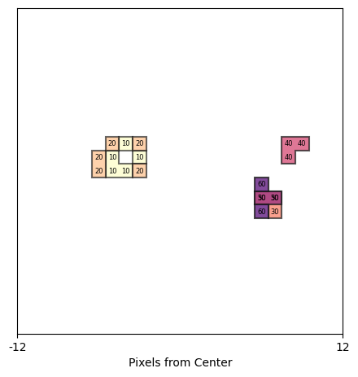

# visualize_pixel_map

A Python package to visualize pixel hit time development from empirphot CSV data.




## Installation

Install the package via pip:

```bash
pip install git+https://github.com/TsvikiHirsh/visualize_pixel_map
```

## Usage
- See the tutorial notebook [here](notebooks/tutorial.ipynb)

### Prerequisites
- A CSV file exported from an empirphot file with columns: `x`, `y`, `toa`, `tof`.

### Example

```python
import visualize_pixel_map as vpm
import matplotlib.pyplot as plt

# Load and prepare data with custom time bins
data = vpm.Data(
    csv_filepath="2024-09-11T160534_000000.empirphot.csv",
    start_time=0.0,
    end_time=0.01,
    time_step=10.0  # 10 nanoseconds
)

# Visualize with various options
data.plot(
    key=800,
    zoom_size=20,
    despine=False,
    time_bins=60, 
    show_scale=True,
    cmap="viridis_r",
    show_labels=True,
    show_legend=True
)
```

### Key Features
- Plots pixel hit time development with envelope contours.
- Supports customizable time bins via `time_bins` (e.g., 40 for [10, 20, 30, 40] ns, 60 for [10, 20, 30, 40, 50, 60] ns).
- Allows zooming with `zoom_size` or `zoom_region`.
- Optional scale showing pixel range when `show_scale=True` and `despine=False`.
- Customizable colormap with `cmap` (e.g., "viridis_r", "magma_r").
- Option to remove axes spines with `despine=True`.
- Optional text labels on pixels with `show_labels` (default True).
- Optional legend for timestamp colors with `show_legend` (default False).

### Data Class
The `Data` class initializes with a CSV file and histogram bin parameters:
- `csv_filepath`: Path to the CSV file.
- `start_time`: Start time in seconds (default 0).
- `end_time`: End time in seconds (default 0.01).
- `time_step`: Time step in nanoseconds (default 10).


## License
MIT License